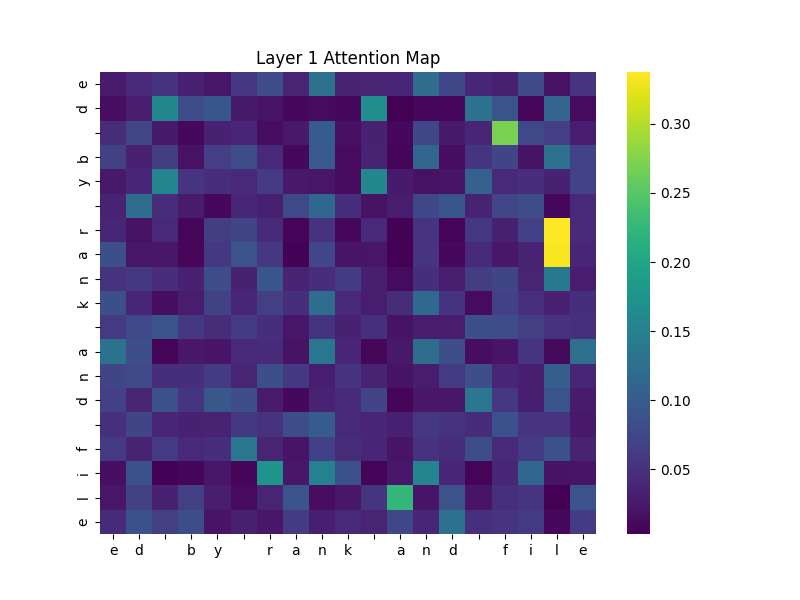

# Transformer From Scratch: Letter Counting in PyTorch

This project implements a Transformer encoder **entirely from scratch using PyTorch**, without relying on high-level modules like `nn.Transformer` or `nn.MultiheadAttention`. It tackles a character-level NLP task: given a 20-character string, the model predicts how many times each character has appeared **before (Task 1)** or **before and after (Task 2)** its position.

---

## Features

-  Manual implementation of scaled dot-product and multi-head attention  
-  Encoder with residual connections and feedforward layers  
-  Learned token + positional embeddings  
-  Custom training loop logging loss, accuracy, and macro-F1  
-  Attention heatmap visualizations per layer  
-  Clean, modular codebase ideal for learning and demonstration

---

## 📁 Project Structure

```
transformer-from-scratch-lettercounting/
├── transformer_model/     # Core components: attention, embeddings, encoder, model
├── scripts/               # Training loop and attention visualization
├── utils/                 # Data loading and label generation
├── data/                  # Input files (excluded via .gitignore)
├── main.py                # End-to-end training pipeline
├── requirements.txt       # Python dependencies
└── README.md              # This file
```

---

##  How to Run

### 1. Install dependencies
```bash
pip install -r requirements.txt
```

### 2. Prepare the data

Create a `data/` folder and add:
- `lettercounting-train.txt`
- `lettercounting-dev.txt`

Each line must be **exactly 20 lowercase characters**.

### 3. Train the model
```bash
python main.py
```

### 4. Visualize attention
```python
from scripts.visualize import plot_attention
from utils.data_utils import build_vocab

vocab = build_vocab()
plot_attention(model, "ed by rank and file", vocab, save=True)
```

---

## 📊 Sample Attention Map

This attention heatmap shows how the model attends to each character in `"ed by rank and file"`:



---


## 📝 License

MIT License — use freely, modify openly.
